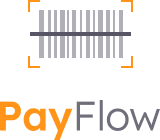
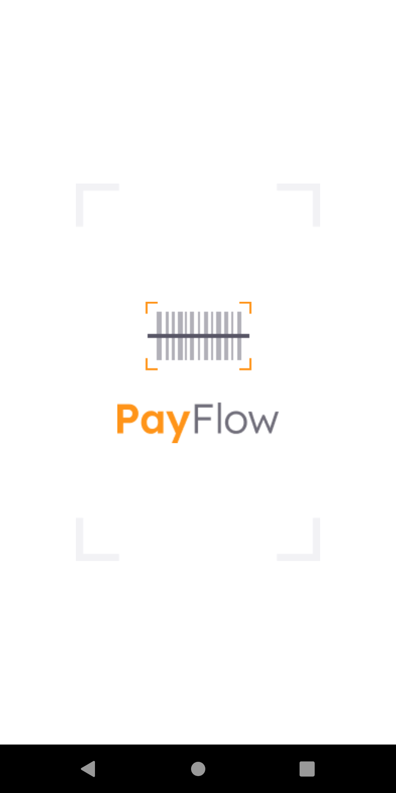
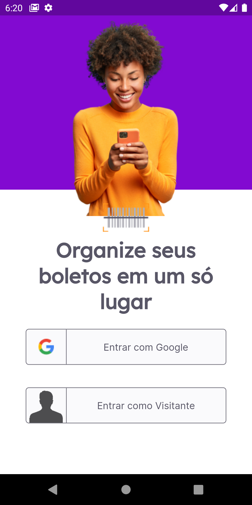
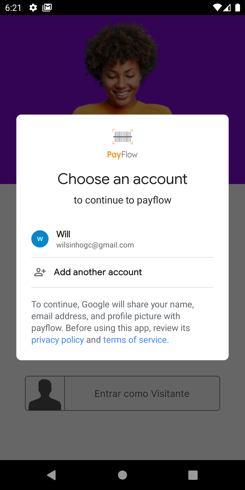
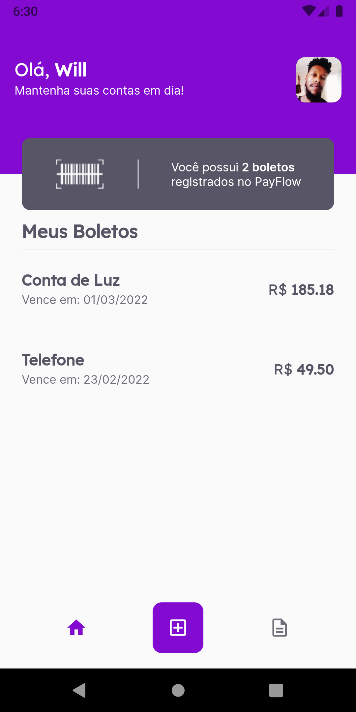
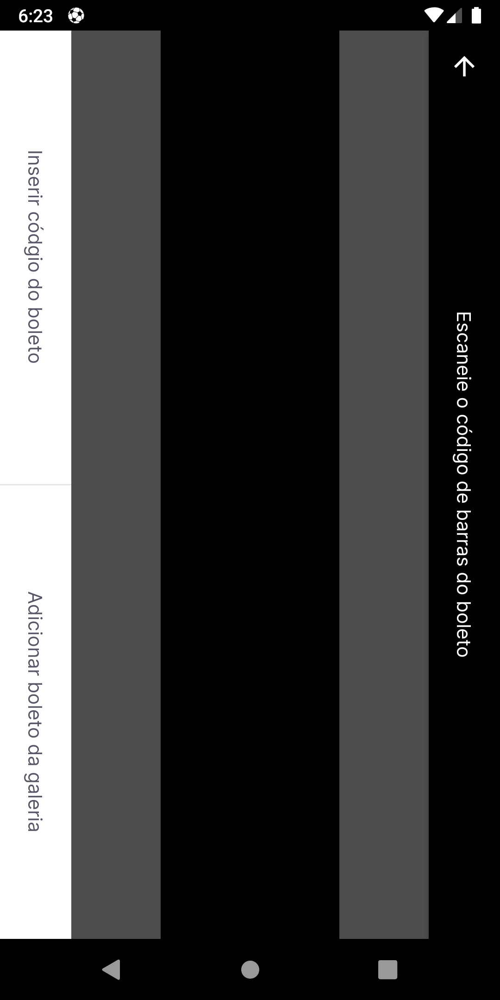
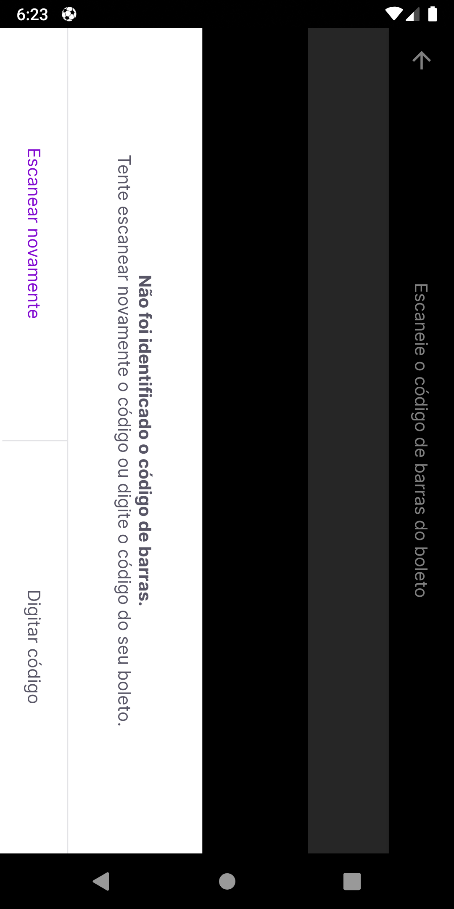
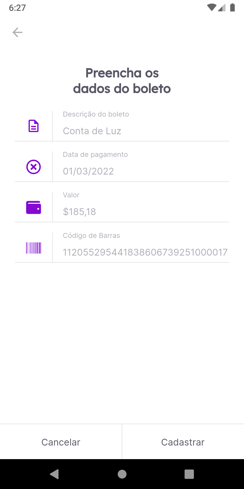

<h1 align="center">PayFlow: </h1>
<h1 align="center">
  </h1>

🚧  Flutter 🚀 Em construção...  🚧

<h1 align="center">
    <a href="https://pub.dev/"> Flutter</a></h1>
	
🚀 Construção de componentes reutilizáveis...

	

</h4>
 <a href="#Descrição">Descrição</a> •
 <a href="#Experiencia">Experiencia</a> •
 <a href="#Features">Features</a> •
 <a href="#Rodar">Rodar</a> • 
 <a href="#Telas">Telas</a> •
 <a href="#Referencias">Referências</a> •  

## Descrição

O PayFlow se trata de um app mobile feito em Flutter 💙 para Gerenciamento de Boletos, contendo recursos como o uso de câmera e galeria, Machine Leaning com MLKit, Firebase Core e SignIn, Animações e Estilizações Personalizadas, entre vários outros pontos, como o uso do SharedPreferences. =>
<a href="https://rocketseat.com.br/">RocketSeat</a>
 

## Experiencia
Achei muito interessante utilizar diversas ferramentas adicionais/bibliotecas nas implementações do Flutter, aprendi mais sobre o uso da navegação por rotas nativas, uso do setstate, um pouco de animações e configurações do Firebase.
Segue abaixo mais detalhes de como tudo isso foi explorado.
### Features
- [x] Acesso para novo usuário via Login com GoogleSignIn
- [x] Cadastrar boletos
- [x] Scanner de código de barras
- [x] Validação nos campos de preenchimento por todo app
- [x] Listagem dos boletos
- [x] Navegação via Bottom
- [x] Tela de extratos

### Rodar
- [x] Fazer Clone do Projeto: git clone https://github.com/willgoncalvescruz/pay-flow.git
- [x] Acessar diretório: cd pay-flow
- [x] Baixar dependencias: flutter pub get
- [x] Fazer Build: flutter run

### Telas
<h1 align="center">
  
  
  
  
  
  
  
</h1>

### Referencias
<h2 align="center">Layout 📋</h2>

   

      O Layout foi desenvolvido por <a href="https://instagram.com/tiagoluchtenberg">Tiago Luchtenberg</a>, e você pode acessá-lo no Figma:
   
   - <a href="https://www.figma.com/file/kLK7FYnWKMoN68sQXcSniu/PayFlow">Mobile</a> 📱
   

<h2 align="center">Arquivo no Notion 📋</h2>

- [Trilha | Flutter](https://www.notion.so/NLW-Together-Conte-dos-complementares-ae22125e899549efb2d4e360b5ee5ca3) 🚀
Projeto:
Aplicação desenvolvida na NLW6 na trilha de Flutter

